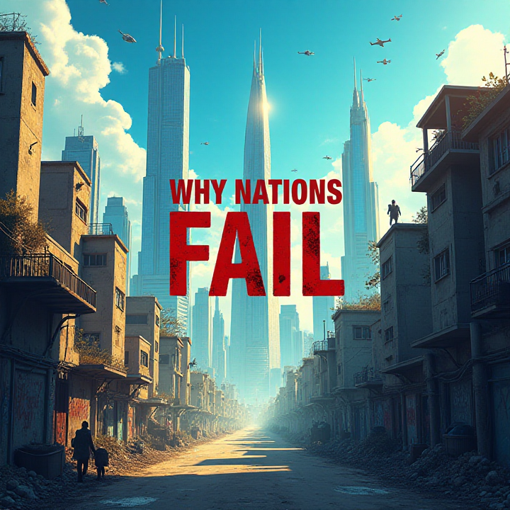
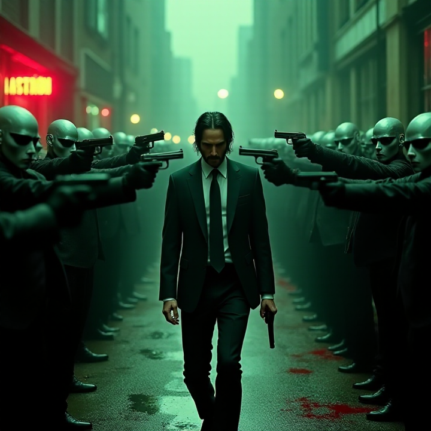

# Contest (all the details are in subfolders)

(sometimes original works I named references)

## Flux download source: https://civitai.com/models/638187?modelVersionId=721627

## Hardware:
GPU: 3070Ti (mobile, laptop version), 8 GB VRAM

16GB of RAM

## SD-Forge used

`set COMMANDLINE_ARGS=--xformers --opt-split-attention --cuda-malloc`

### Book - Why nations fail ?

#### prompt:

Create a dramatic and thought-provoking book cover illustration for the nonfiction book 'Why Nations Fail.' The scene should depict a stark contrast between wealth and poverty under a bright, clear blue sky with a few wispy clouds. In the upper half of the image, showcase a futuristic cityscape of towering, sleek skyscrapers made of glass and steel, reflecting the sunlight with a golden hue, symbolizing wealth and modernity. These skyscrapers should have clean lines, modern architecture, and a sense of opulence, with small details like helicopters flying nearby or lush rooftop gardens. In the lower half of the image, portray a gritty, overcrowded concrete jungle representing poverty, with crumbling, densely packed buildings made of worn concrete, covered in graffiti, and surrounded by narrow, littered streets. Add small details like laundry lines hanging between buildings, street vendors with carts, and people in tattered clothing walking through the shadows to emphasize the struggle. The ground should have a grayish, dusty tone, contrasting with the vibrant sky above. In the center of the image, overlay the title 'WHY NATIONS FAIL' in bold, capital letters using a modern, sans-serif font with a slight distressed texture, colored in a deep red or black to stand out against the background. Ensure the title is large and commanding, spanning across both the rich and poor sections to symbolize the divide. Add subtle symbolic elements, like a cracked flagpole or a faded national emblem in the background, to hint at the theme of failing nations. The overall mood should be intense and reflective, with a cinematic quality, using sharp contrasts in lighting—bright sunlight illuminating the skyscrapers and darker shadows in slums below.

Steps: 20, Sampler: Euler, Schedule type: Simple, CFG scale: 1, Distilled CFG Scale: 3.5, Seed: 703372673, Size: 720x720, Model hash: fef37763b8, Model: flux1DevHyperNF4Flux1DevBNB_flux1DevBNBNF4V2, Version: f2.0.1v1.10.1-previous-659-gc055f2d4, Module 1: ae

final result:

original:

### Movie - John Wick 2

#### prompt:
A dramatic, high-intensity action scene blending the relentless energy of John Wick with the iconic style of The Matrix, rendered in a sleek, cinematic style. A lone, battle-hardened assassin, distinct in appearance with short, rugged hair and a sharp, weathered face (resembling Keanu Reeves), stands at the center in a tailored black suit and tie. His expression is fierce and determined as he holds two pistols aimed in opposite directions. Surrounding him are a dozen identical white skin Smith agents from The Matrix, each in their signature black suits, green-tinted sunglasses, and earpieces, pointing their guns at him in a tense, circular standoff. The background is a dark, urban alleyway with wet pavement reflecting dim streetlights, adding a gritty atmosphere. Red accents highlight the scene—blood splattered on the ground, a faint red glow from a distant neon sign, and subtle red highlights on the assassin’s suit. The Smith agents’ green digital aura subtly flickers, hinting at the Matrix code, while the composition remains dynamic and symmetrical, with sharp contrasts and a sense of impending violence, capturing the stylish, high-stakes energy of both worlds.

Steps: 20, Sampler: Euler, Schedule type: Simple, CFG scale: 1, Distilled CFG Scale: 3.5, Seed: 887608613, Size: 720x720, Model hash: fef37763b8, Model: flux1DevHyperNF4Flux1DevBNB_flux1DevBNBNF4V2, Version: f2.0.1v1.10.1-previous-659-gc055f2d4, Module 1: ae

final result:

original:

### Music album - Three Days Grace, Human

#### prompt:

A stylized, surreal humanoid figure standing upright, directly facing the viewer with a blank, mask-like face and glowing red circular eyes set in a dark, featureless head. The body is translucent, with a chaotic, illustrated fusion of mechanical parts and abstract anatomical structures—ribs, gears, tubing, and spirals—visible inside the torso. The color palette includes black, deep red, electric blue, and burnt orange. The background is divided horizontally: stark black above, pale beige or white below. The figure and internal components are rendered in a flat, graphic, semi-abstract style, with no photorealism. Visual reverberation and glitch effects subtly distort the edges of the figure—lines duplicate, echo, or fragment like a digital glitch or soundwave reverberation, enhancing the sense of disintegration. The style evokes dystopian, conceptual themes with a cold, detached atmosphere.

Steps: 20, Sampler: Euler, Schedule type: Simple, CFG scale: 1, Distilled CFG Scale: 3.5, Seed: 4124000554, Size: 512x512, Model hash: fef37763b8, Model: flux1DevHyperNF4Flux1DevBNB_flux1DevBNBNF4V2, Version: f2.0.1v1.10.1-previous-659-gc055f2d4, Module 1: ae

final result:

original:

